## Домашняя фабрика прототипов печатных плат
Методов изготовления печатных плат очень много: сперва было ручное выцарапывание дорожек ножом, потом лак, потом лазерные принтеры и ЛУТ, потом фоторезист, и сейчас ЧПУ станки и фрезеровка дорожек.
Все методы делятся на травление и фрезеровку. Последняя недостаточна точна. Поэтому остановимся на первом. И в промышленности используется фоторезистивная его разновидность, а это явно не спроста.
Я расскажу как воспроизвести эти процессы в домашних условиях с точностью дорожка/зазор 0.1-0.15 мм, отверстие 0.2-0.3 мм, поясок 0.15 мм.

Да, на YouTube по запросу "изготовление печатных плат в домашних условиях" вы найдете много видео. Но мало где демонстрируется процесс металлизации отверстий, позволяющий изготавливать двухслойные платы. Да и все остальное там показывается плохо, недостаточно подробно, не учитываются нюансы и точные параметры процесса необходимые для достижения вышеуказанной околопромышленной точности и качества. Также там демонстрируются только удачные дубли, а весь брак, которого там 90% остается за кадром.

А что можно сказать про компании, которые занимаются изготовлением печатных плат на заказ, под ключ, профессионально? Если их спросить как они это успешно делают - то они ответят, что используют процесс, разработанный компанией X. А компания X предоставит вам базовую информацию, список этапов, но о тонкостях и параметрах каждого ничего не скажет, а лишь предложит за несколько миллионов рублей купить их оборудование которое делает каждый этап идеально. И даже если вы купите - вы не узнаете точный состав используемых растворов и иные параметры и будете зависеть от поставок этих растворов и иных материалов компанией X, ежегодно оплачивать дорогие лицензии их программного обеспечения, не говоря уже о том что оборудование рассчитано под большие панели и объемы и не подходит для прототипирования в плане стоимости и размеров.

Я представляю вам процесс в котором все используемое программное обеспечение разработано мной и имеет открытый исходный код, все используемые материалы доступны для свободного приобретения физическими лицами в малых объемах, все используемые растворы имеют открытый рецепт, точную инструкцию приготовления и каждый из ингредиентов - это не торговое название, а конкретная формула, все оборудование можно купить в любом месте, а не только у одной компании и его чертежи и 3D модели публично доступны.

## Точность
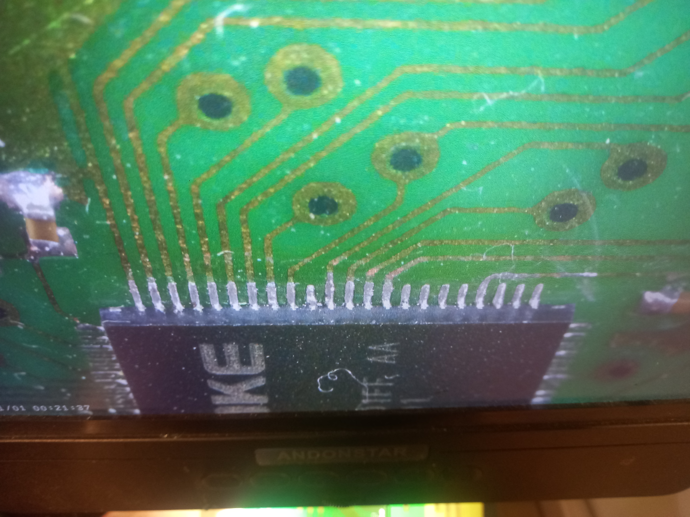

## Методы в фоторезистивной технологии
Ключевым моментом в изготовлении двухслойных плат является химическая металлизация стенок переходных отверстий.
Но их мало металлизировать, нужно их металлизацию защитить от растворения при травлении проводящего рисунка.
Поэтому существуют три метода такой защиты:
1. Тентинг-метод. Металлизацию отверстий защищает непосредственной сам пленочный фоторезист, за счет того что он толстый (50 мкм). Плюс данного метода в том, что он самый простой, легкий и дешевый. Минус - он неточный: дорожка/зазор 0.15 мм, отверстие 0.3 мм, поясок 0.2-0.3 мм. Самое главное - поясок отверстия должен быть большим.
2. Позитивный метод. Наиболее часто применяемый в промышленности. Фоторезист наносится на свободные от дорожек и отверстий участки, затем осаждается гальванический слой меди и поверх него той же гальваникой осаждается слой олова, либо олова-свинца. Плюс - точность выше: дорожка/зазор 0.1 мм, отверстие 0.2 мм, поясок 0.15 мм.
Минус - нужен дополнительный раствор для осаждения олова и удаления его. Также нужны оловяные электроды для его осаждения (которые дорогие). Этот раствор нестабилен, быстро разлагается, да и покрытие олова на медь имеет не очень хорошее сцепление, для решения этих проблем нужны проприетарные реактивы.
3. Полуаддитивный метод с дифференциальным травлением. Используется стеклотекстолит с тонкой медной фольгой (3 мкм). Выполняется осаждение меди на стенках отверстий, за счет чего усиливается и толщина основного слоя до 5 мкм. Фоторезист наносится на свободные от дорожек и отверстий участки, после чего толщина меди непокрытых им дорожках и отверстиях наращивается до 30-40 мкм той же гальваникой. Затем выполняется травление, 5 мкм стравливается быстро, а 40 мкм - не стравливается. Тут точность еще выше и дорожка/зазор может достигать 0.05 мм, но минус в том, что сложно найти на рынке стеклотекстолит FR-4 с такой тонкой фольгой. А брать 18 или 35 мкм и травить до толщины 3 мкм - неравномерно будет и ничего не получится. Стравить всю фольгу и затем с нуля осадить медь - недостаточно хорошо держаться будет.

В общем, надежно, стабильно и повторяемо в домашних условиях работает только первый метод. Он продемонстрирован в видео Demo.mp4 (Demo.zip).

## Тентинг-метод
1. Лист FR-4 и обработка на ЧПУ.
2. Химическое и гальваническое осаждение меди.
3. Нанесение фоторезиста, засветка, проявка.
4. Травление проводящего рисунка.
5. Удаление фоторезиста.
6. Нанесение паяльной маски, засветка, проявка, дубление.
7. Нанесение шелкографии.
8. Депанелизация.
9. Печать паяльной пасты, Pick & Place компонентов, пайка феном.

## Файлы проекта
Вам нужно экспортировать Gerber-файлы из САПР в котором вы разработали свою плату. Также если планируете сборку/пайку SMD нужно экспортировать centroid-файл.
Выбираем эти файлы в моем программном обеспечении, которое лежит в папке Software репозитория. Версия 3 более удобная и простая, версия 2 более расширенная.
С параметрами в главном меню лучше не играться. Если вы хотите панель побольше, чтобы уместить плату размером побольше или большее количество маленьких плат - вам придется переделывать файлы 3D моделей в последующих этапах, не исключены дополнительные проблемы.

## Лист FR-4 и обработка на ЧПУ
Я использую стеклотекстолит FR-4, листы 200x300 мм, толщина от 0.5 до 1.5 мм в зависимости от применения полученной печатной платы, толщина медной фольги от 18 мкм до 35 мкм. Продается много где.
Лучше использовать 18 мкм. Казалось бы, какая разница, 18 мкм или 35 мкм, но когда у вас дорожка/зазор 0.15 мм - разница существенная в боковом подтравливании.

Для обработки я использую ЧПУ станок CNC 3018 MAX с Aliexpress со шпинделем на 500 ватт.
После покупки станка я его доработал аппаратно:
1) добавил пылесборник на шпиндель, к которому подключаю пылесос (тоже продается на Aliexpress)
2) добавил камеру на каретку со шпинделем, 3D модели для печати крепления прилагаю
3) добавил микропереключатели чтобы сделать возможным homing
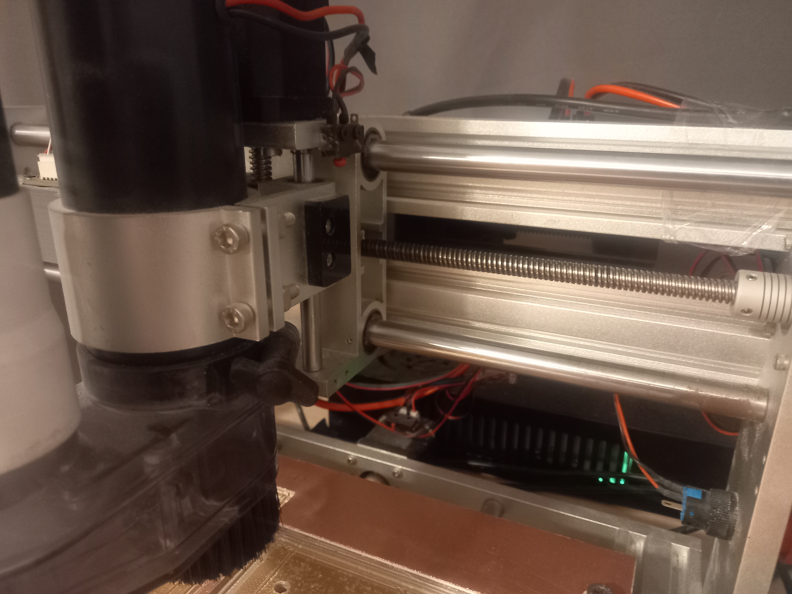
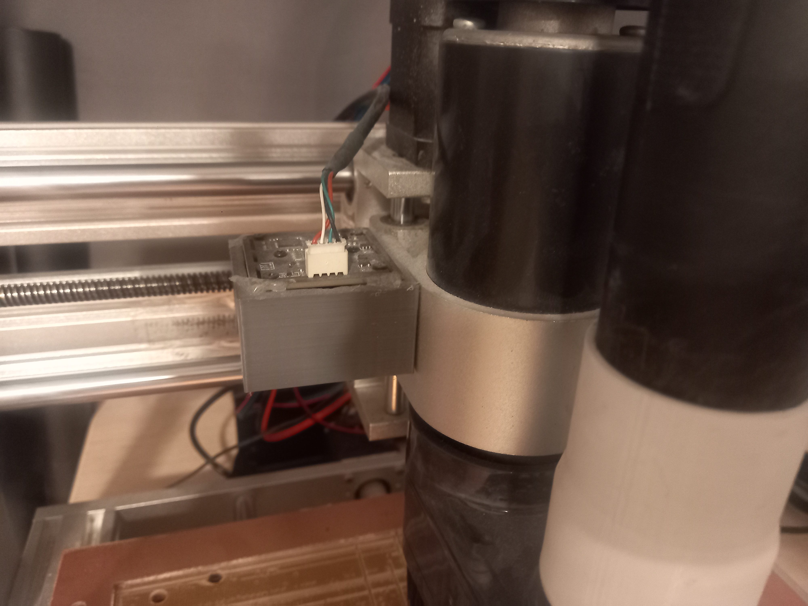
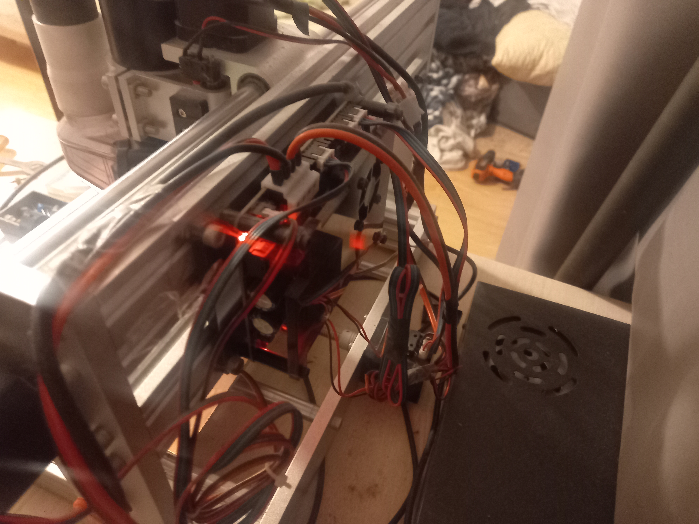
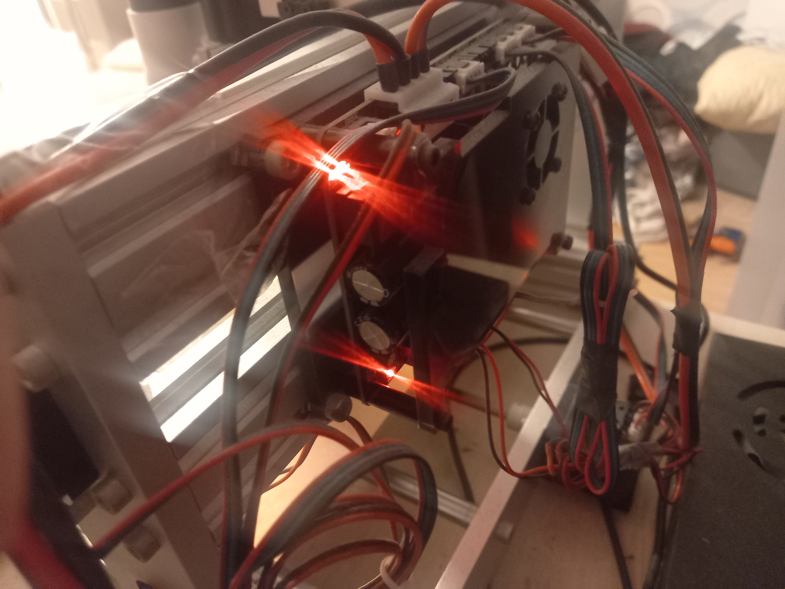

Важно откалибровать количество шагов на миллиметр у ЧПУ станка по каждой из осей, а также угол между осями XY и иные параметры. Делаю это один раз с помощью собственного программного обеспечения и фотошаблона, размещаемого в поле зрения камеры на рабочем поле станка.

Также нужно подобрать экспериментально скорость подачи и иные параметры.

В качестве подложки (жертвенного стола) я использую толстый (5 мм) лист FR-4 без фольги, на эту подложку уже креплю тонкий рабочий лист стеклотекстолита FR-4. Важно чтобы он ровно (без прогибов) ложился на подложку.
Выглядит и крепится это примерно так:
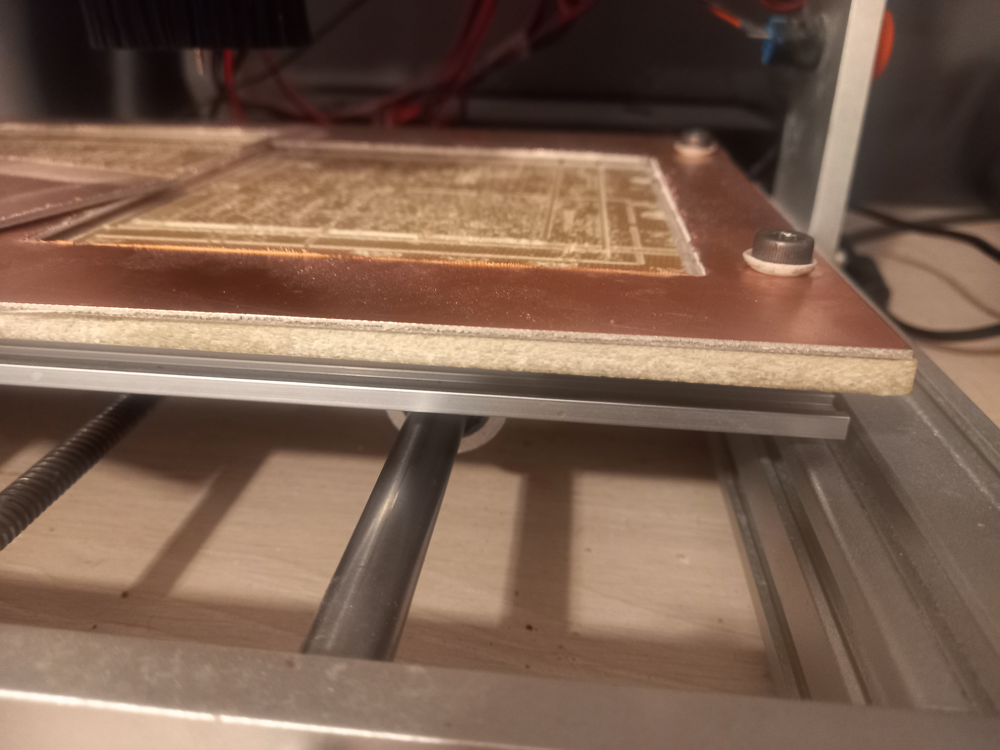

Я использую сверла фирмы X-CAN (с Ozon) для сверления основных и реперных отверстий и для вырезания квадратной панели фрезу 1.5 мм тоже от них. Выглядят они так:
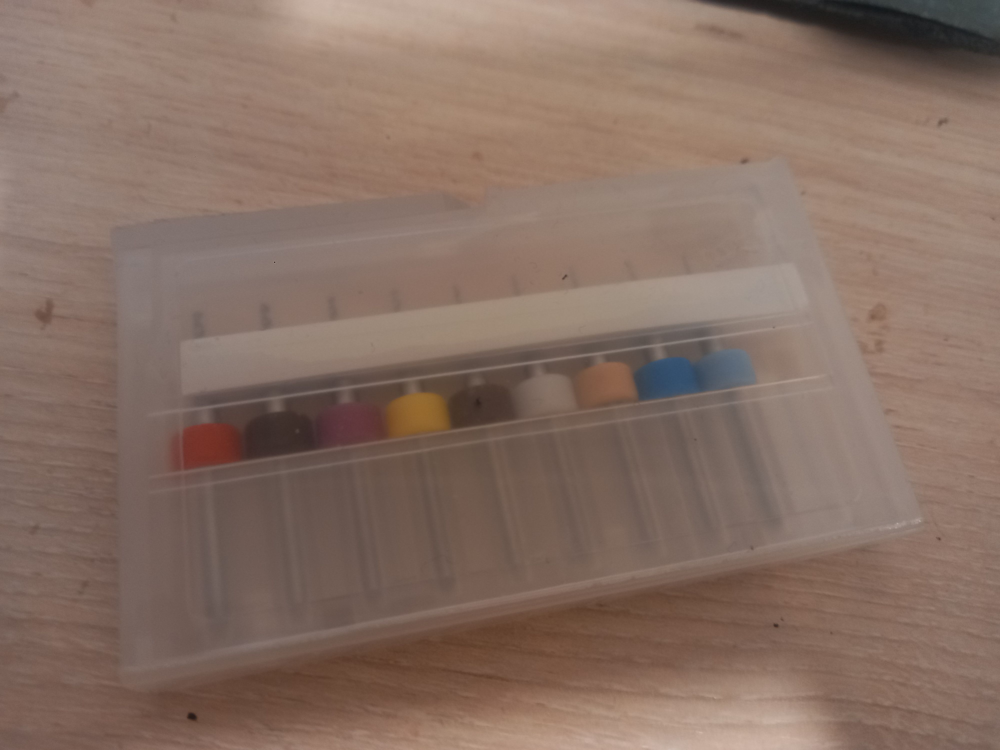
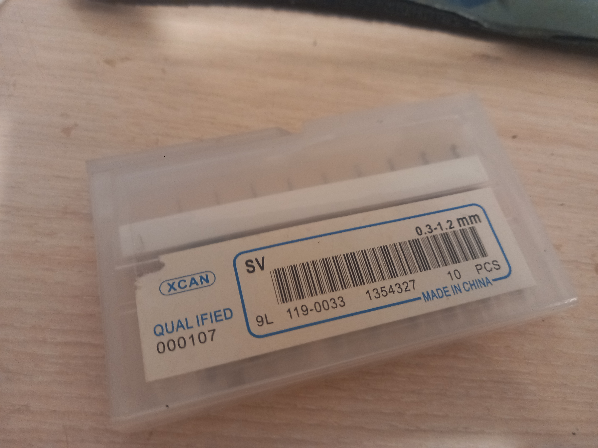
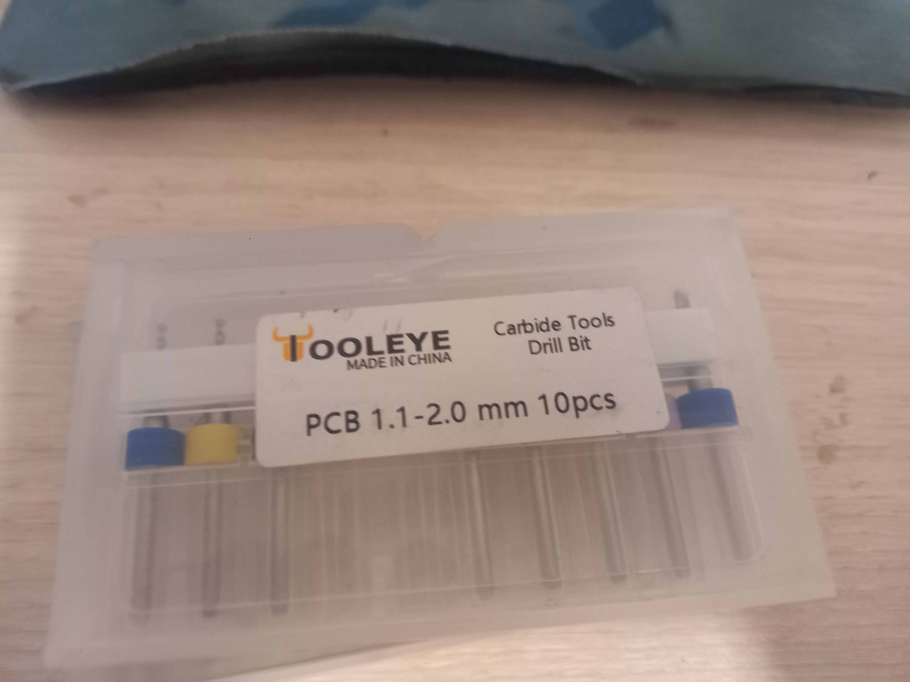

Важно для сверления всех отверстий использовать сверла одной и той же фирмы из одной и той же серии, одной и той же длины, с одним и тем же хвостовиком чтобы они одинаково зажимались в патрон и сверление отверстий каждого диаметра происходило на одинаковом уровне оси Z и кривизна этой оси не портила позиционирование отверстий по XY. Также важно осторожно устанавливать сверло в патрон, не допуская изгиба, иначе центр вращения не совпадет с центром сверла и диаметр отверстия будет чуть больше.

Саму обработку тоже запускаю из своего программного обеспечения (как это делать показано в видео), важно подключать станок и его камеру в два USB порта (не использовать USB-хаб для объединения их в один), также не использовать USB-удлинители, потому что они могут неожиданно во время сверления оборвать соединение. Ранее я использовал Grbl Control, но там нет функционала повтора цикла, отметки какие отверстия просверлены, какие нет, превью, компенсация кривизны, т.е. функционал общий, не такой гибкий и заточенный под производство печатных плат, как в моем ПО.

Далее нужно снять заготовку с ЧПУ станка, обработать поверхность и края наждачкой зернистости от P400 до P800 (лучше последнее), не пропуская области вокруг отверстий (чтобы они тоже покрывались царапинами от зерен наждачки), проткнуть иголкой или сверлом каждое отверстие в котором застряла стружка, затем протереть безворсовой салфеткой, смоченной в изопропаноле и просушить 10 минут при 70C в конвекционной печи (пойдет обычная кулинарная, не микроволновая, а та что на ТЭНах).
Далее заготовку нужно взвесить, желательно с точностью до миллиграммов, чтобы в дальнейшем по плотности меди оценивать толщину фольги (но это необязательно).

При промывке изопропанолом необходимо использовать безворсовые салфетки (cleanroom wipers):
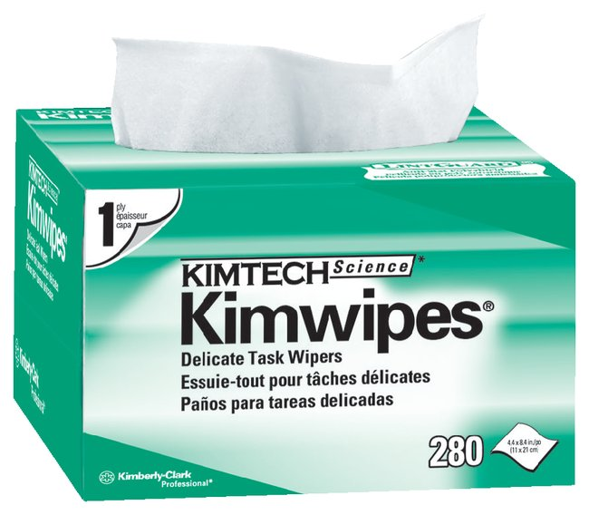

Вот так заготовка выглядит после этого этапа:
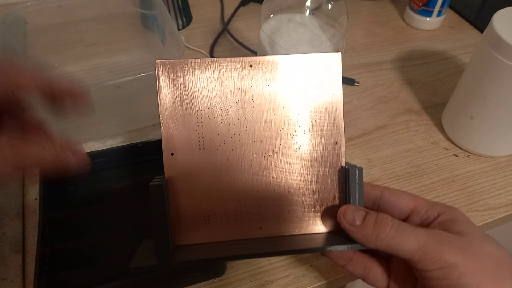

У меня заготовка около 122x122 мм, но вы можете в настройках программы попробовать установить другой размер, но вам придется и последующие этапы и станки под него адаптировать, и возможно вы наступите на грабли.
Не обязательно использовать CNC 3018 MAX, может подойти и другой ЧПУ станок. Но ручной микродрелью сверлить точно не стоит - отверстия будут неаккуратными и непригодными к следующему этапу. Да и в проводящий рисунок они не попадут. Даже с ЧПУ станком, но не откалиброванным не попадут, а вручную сверлить - шансов вообще нет. На YouTube у некоторых людей получается - но это везение и удачные попытки, повторяемость низкая, а неудачи остаются за кадром, да и неудобно это.

После этого этапа для перемещения заготовки нужно брать её за торцы (не за поверхность/середину). А если хочется положить заготовку, не делайте этого, ставьте вертикально на подставку.

От этого этапа до следующего можно её держать долго (хоть неделю).

В папке CNC лежат файлы настроек ПО под мой станок (они вам не сильно понадобятся, потому что у вас будут другие результаты калибровки), а также 3D модели (из Blender) деталей для печати из PETG пластика (адаптер для пылесборника, крепление для камеры, подставка и адаптер для депанелизации [о ней позже]).

Время этапа: около 30 минут.
Стоимость оборудования: $400.
Стоимость одного цикла: $1.5 (стоимость FR-4 + износ сверел и фрез).

## Химическое и гальваническое осаждение меди
Это очень важный этап в изготовлении двуслойных плат, поскольку соединяет два слоя путем осаждения меди на стенках отверстий. Не забываем про средства индивидуальной защиты от опасных веществ и о том, что подэтапы этой операции важно выполнять друг за другом и без пауз. Под паузой понимается перерыв дольше минуты-двух.
Моя установка выглядит так:
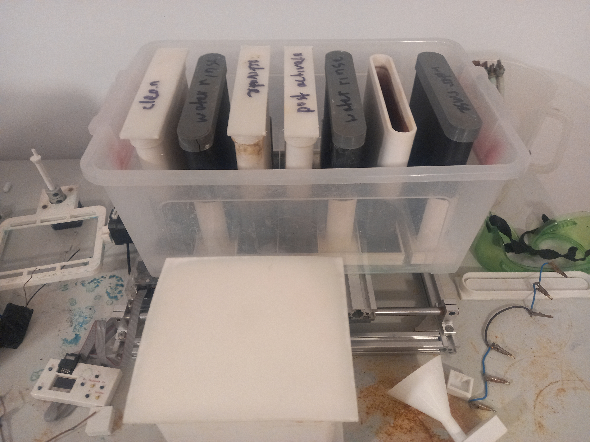

Что мы видим: рама, шаговый двигатель, ходовой винт и ездящий по одной оси стол. Это все взято и собрано из еще одного набора для сборки CNC 3018 (взял вариант на Ozon без шпинделя и лазера) и получил такой набор.
Этот стол движется туда-сюда для перемешивания всех ванн сразу. В моей программе можно нажать кнопку которая отправит необходимые для такого движения GCode команды, а можно сохранить их как файл. Также можно с его помощью сгенерировать файл GCode, залить на SD-карту и через автономный контроллер запускать его на этом станке, что я и делаю.

Перемешивать нужно именно в направлении которое показано на фото, т.е. поперек ванн, чтобы раствор затекал и смачивал отверстия в заготовке.
Не надо делать всякие другие механизмы перемешивания, они затратнее, опробованы мной и работают хуже.
На алюминиевом столе стоит полипропиленовый контейнер купленный в FixPrice. К его дну на "жидкие гвозди" приклеена подставка. В этих подставках стоят сами ванны.
Подставки напечатаны на 3D-принтере из PETG-пластика, файлы моделей прилагаю.

Также на крышке, которая держит заготовку, расположен соленоид. Он нужен чтобы бить в торец заготовки и вышибать из её отверстий диаметром 0.3 мм застрявшие пузырьки выделяющегося в процессе водорода.

Сами ванны напечатаны из чистого полипропилена (PP), конечно в YOUSU PP есть добавки которые снижают усадку и это хорошо, а в REC PP+ они еще лучше.
Полипропилен со стекловолокном (PP-GF) нельзя использовать, хоть он печатается легче, но он дает пористую структуру, у него спекаемость слоев и устойчивость к химии хуже, он будет протекать, спустя месяц раствор выльется из закрытой емкости и оставит налет. Не подойдут и другие 3D-печатные полимеры. Важна именно такая форма ванны, как в моих файлах 3D модели. Квадратная (прямоугольная) форма заставит медь оседать в углах сосуда и усложнит печать такой ванны, а также промывку после её использования.
Пластик PP сложный, необходим 3D принтер с закрытым объемом (пассивная или лучше активная термокамера). Я использовал Creality K1 Max, сопло 0.6 мм (не используйте 0.4 мм и менее, заклинит экструдер так как полипропилен мягкий).
Для обеспечения адгезии к столу необходимо положить лист полипропилена 4 мм (именно лист и именно такой толщины, можно больше, но не меньше). Важно его закрепить к столу зажимами, а лучше болтами.

Печатать нужно медленно 50 мм/сек при температуре 225C и без нагрева стола, с высотой слоя 0.1 мм.
Не печатайте на скотч, на специальные адгезивы и фирменные пленки для полипропилена, у вас ничего не получится, нужен именно лист (и толстый, 4-5 мм).
После печати вырезаем кусок из листа, печатаем подставку из PETG.
Приклеиваем дно ванны к дну подставки и ставим её в общее место. Пойдет любой каучуковый клей, хоть и пишут что для полипропилена он не подходит. А вот эпоксидный клей действительно тут не подходит. Вот так:
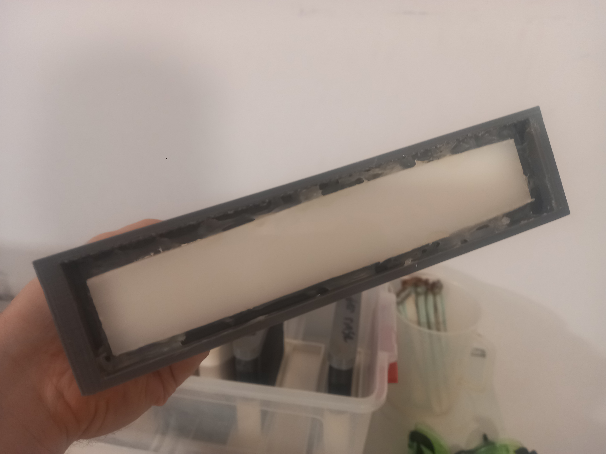

Печатаем также крышки из чистого PP, можно их подписать. Эти крышки плотно закрывают ванну обеспечивая герметичность и хранение растворов на месяцы и годы.
Также необходима рабочая крышка из PETG, с продетой в нее медной проволокой и зажимами крокодил, а также соленоидом, которые будут держать заготовку. Вот так:
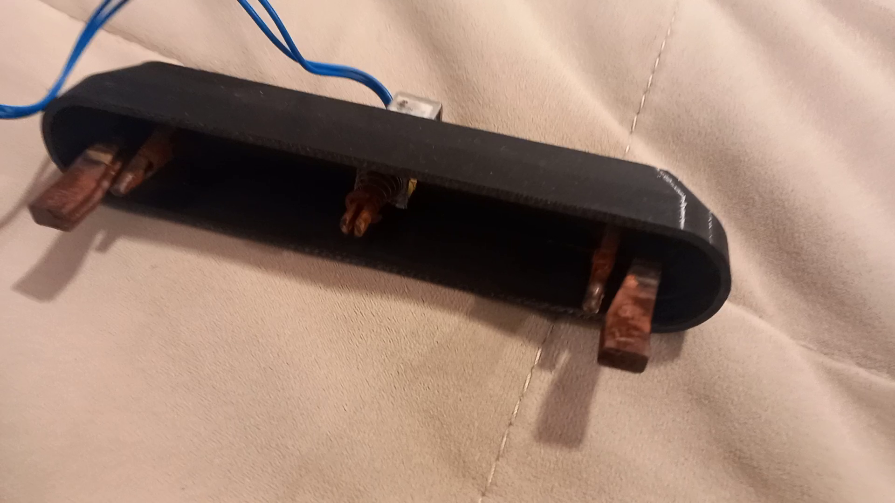

Да, можно сделать лучше и чтоба она более ровно держала заготовку, но и так работает прекрасно.

Черные ванны у меня из ABS-GF4 с серыми крышками из PETG - они для воды, поэтому из таких простых пластиков.

Все ванны размещены в контейнере из того же полипропилена на всякий случай потому что может разлиться и пусть оно лучше туда выльется чем разольется по всему помещению.
3D печать из полипропилена - это лучший способ изготовить эту установку дома. Склеивание из листов, использование герметиков, других пластиков и методов не работает - герметики и клеи не устойчивы к химии и откажут после месяца работы, если конечно не сразу.
Литье может сработать, но в домашних условиях и единичном экземпляре - это весьма дорого.

В ваннах (справа налево) следующие растворы:
1. Кислая очистка.
2. Промывка 1.
3. Активация.
4. Пост-активация.
5. Промывка 2.
6. Химическое осаждение меди (electroless copper deposition).
7. Промывка 3.
8. Гальваническое осаждение меди (electrolytic copper deposition) (отдельно).

Состав этих растворов описан в Process 01.pdf лежащем тоже в репозитории. Только у меня 500 мл раствора, не как у Hydrogen Time, автора этой работы и соотвественно количество каждого ингредиента пропорционально больше. Главное готовить их на магнитной мешалке, не спешить и подождать подольше когда каждый ингредиент растворится перемешиванием почти полностью или вовсе полностью, перед добавлением следующего.
Для приготовления растворов используем дистилированную воду или даже деионизированную.
А вот для промывки можно фильтрованную питьевую из под крана, хотя лучше тоже дистилированную, особенно для промывки 2.
Раствор кислой очистки и активации условно вечный, живет год-два и больше, как понять, что он истек, написано в Process 01.pdf. Промывки меняю раз в 5-10 циклов производства. Пост-активатор меняю раз в 20-30 циклов. Химическую медь готовлю заново каждый цикл.
У меня кислая очистка, как и гальваническое осаждение меди (о котором позже) происходят при комнатной температуре, в отличии от Process 01.
Также там указано что раствор electroless copper deposition нужно после использования подкислять, и перед следующим использованием наоборот подщелачивать. Но не указано до какого pH, поэтому я просто в каждом производственном цикле готовлю его заново на магнитной мешалке непосредственно перед использованием. Тем более этот раствор склонен осаждать медь на любых пылинках, соринках, неровностях сосуда в который налит. Но если его использовать и после выливать и выбрасывать - проблем нет. Если после использования и слива раствора на его стенках все же осела медь - то желательно перед следующим циклом производства растворить её персульфатом аммония.
В составе electroless copper deposition не уточнено 4 капли Тритон X-100 - это сколько. Я использую 0.1-0.15 мл на 500 мл раствора (отмеряю шприцом).

Также рецепт раствора electrolytic copper deposition у меня другой (живет около 1 цикла производства, если заготовка 122x122 мм и ванна 2л):
750 мл дистилированной воды (горячей, 80C)
180 г медного купороса
130 мл серной кислоты (45% аккумуляторной 1.28 г/см^2)
0,06 г тиомочевины
0,06 г хлорида натрия
0.05-0.1 мл Тритон X-100
Долить воды до отметки в 1 литр

Можно использовать вариант с проприетарным блескообразователем (живет около 4 циклов производства, если заготовка 122x122 мм и ванна 2л):
750 мл дистилированной воды (горячей, 80C)
160 г медного купороса
200 мл серной кислоты (45% аккумуляторной 1.28 г/см^2)
0.07 г хлорида натрия
5 мл Купралайт-7400
Долить воды до отметки в 1 литр

Есть еще рецепт от канала "шоу бородатого инженера" (не проверял, не знаю насколько хорошо работает):
750 мл дистилированной воды (горячей, 80C)
250 г медного купороса
200 г серной кислоты (45% аккумуляторной 1.28 г/см^2)
5 мг тиомочевины
2,7-нафталиндисульфокислота 0.5г/л
Возможно несколько капель Тритон X-100 или иного ПАВ
Долить воды до отметки в 1 литр

После истечения "срока жизни" покрытие неравномерное. Вы можете следить за истечением его срока службы по уровню мутности раствора, он возрастет когда срок начнет подходить к концу.

Этот раствор заливается вот в такую ванну из полипропиленового контейнера (3D модели тоже прилагаю). Тут шаговый двигатель, который перемешивает раствор покачиванием заготовки на 5-10 мм по нижнему краю.
Вот как это выглядит:
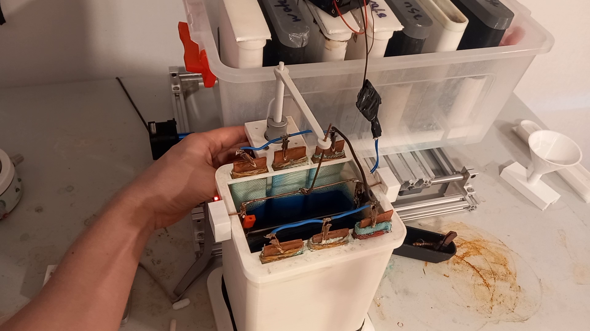

Электроды - это шины из меди М1 размером 3 х 30 х 200 мм, обернутые в полипропиленовую химостойкую ткань (анодные чехлы), для защиты от образования шлама. Конечно лучше медь с добавлением фосфора, но у меня без.
Они должны иметь именно такой размер и площадь и располагаться по обе стороны заготовки, иначе покрытие будет неравномерным. Суммарная площадь анодов должна быть вдвое больше площади заготовки. И они должны для большей равномерности быть подальше от неё. Они будут растворяться в процессе работы, аноды такого размера растворятся наполовину лишь после 100 циклов производства, после их нужно заменить. Каждые 5 циклов производства необходимо отмывать аноды от шлама (промывать чехол водой и обрабатывать сам медный анод наждачкой).

В Process 01 также указан порядок действий для тентинг-метода: clean, water rinse, activate, post activate, water rinse, electroless copper, water rinse, electrolytic copper, water rinse.
Но у меня время другое: clean - 10 минут, activate - 10 минут, post-activate - 5 минут, electroless copper - 1 час, electrolytic copper - 1 час 10 минут.
"Water rinse" в Process 01 - это я просто опускаю заготовку (вместе с крышкой на которой она закреплена) в ванну промывки, на время от 2 до 5 секунд.

Если в растворе активатора плавают хлопья - нужно их отфильтровать, если не помогло - значит истек его срок годности и нужно его приготовить заново.

Итак, выполняем микротравление в горячем (60C) 20% растворе персульфата аммония 10-20 секунд (ну или не очень микро если у нас 35 мкм FR-4, чтобы оставить 18 мкм, 2-3 минуты), затем промываем водой, затем обезжириваем в 5% растворе гидроксида натрия (2 минуты), промываем водой, далее поочередно опускаем заготовку в каждую из ванн системы на нужное время.

После химического осаждения меди (electroless copper deposition) проверьте края (торцы) заготовки, если они полностью покрыты медью - подэтап удался, если нет - промойте заготовку водой, повторите активацию, пост-активацию, промывку и выполните химическое осаждение заново в новом растворе химической меди. Если и это не помогло, приготовьте заново растворы активатора и пост-активатора.

Если все нормально - то промываем водой (аккуратно, погружением, можно двойным, чтобы отмыть полностью) и в последнюю ванну [electrolytic copper deposition] погружаем с постоянным током около 2 А на заготовку 122x122 мм (если у вас больше/меньше - пересчитайте пропорционально), заготовка к минусу, аноды к плюсу. Раствор я держу при комнатной температуре, не нагревая его до 60C как Hydrogen Time. Важно как можно больше соединений проводов с заготовкой и анодами сделать паянными, чтобы не болтались.

Если после этого процесса появляются сильные неровности, наросты и большие кристаллы меди, а также сильные заусенцы на углах - значит сила тока слишком большая или электролит грязный, нужно готовить раствор заново и повторять все сначала.

Если все получилось равномерно - промываем водой (хоть из под крана), сушим в печи при 70C около 10 минут и обрабатываем наждачкой Р800, промывая изопропанолом и протирая безворсовыми салфетками. Ставим заготовку на подставку. И так она может дожидаться следующего этапа до нескольких часов точно. Но при дальнейшем её перемещении берите её пальцами за торцы и технологические поля, а вообще в идеале еще и в перчатках.

Результат:
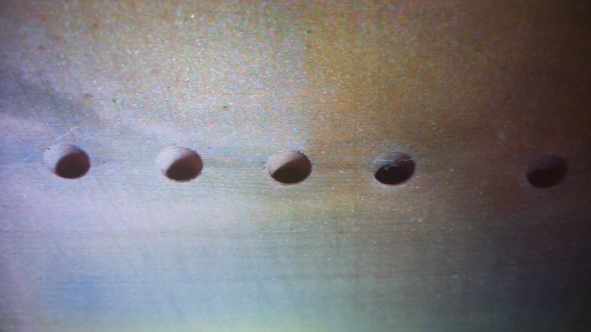

Вы можете взвешивать заготовку до, во время и после процесса, чтобы по массе через плотность меди вычислить толщину (сколько осадили). Только взвешивайте предварительно просушив.

Если вы оставляете этот раствор [electrolytic copper deposition] стоять более 10 минут в ванне без тока и перемешивания - вынимайте из неё аноды и заготовку.

Не используйте всякие графитовые спреи/углеродные краски которые советуют для создания проводимости перед гальваникой самоделкины, это ненадежно. Также ненадежно использование термореактивных веществ типа аммиачного комплекса гипофосфита меди. Если даже оно будет работать устойчиво - то большие (3-5 мм) отверстия непрокроются, и стенки будут не всегда ровные, и еще большой вопрос не сломается ли такая плата в процессе эксплуатации.

Не используйте механическую металлизацию (гильзование), она трудоемка и не выдерживает процесс reflow soldering, да и размеры via там большие.

В папке Galvo есть blend-файл с 3D моделями всего вышеупомянутого.

Время этапа: чуть меньше 2 часов.
Стоимость оборудования: $500 (реактивы, пластик для ванн, механизмы перемешивания, лабораторная посуда, установки вакуумной фильтрации, медные аноды).
Стоимость одного цикла: $0.1 (в случае с электролитом на основе Купралайт-7400), $2 (в случае с моим рецептом).

## Фоторезист: нанесение, засветка, проявка
Ну во-первых: он бывает пленочный и жидкий.
Жидкий редко где встретишь, аэрозольные балоны Kontakt Chemie Positiv 20 и Cramolin Positiv Resist дорогие и мало где продаются, также есть жидкий в банках, содержимое их нужно растворять в этилацетате и распылять с помощью аэрографа.
Ну, во-первых вы не сможете руками распылять одинаково толстый слой при каждом цикле производства, а от толщины зависит энергия экспонирования (сколько света должно попасть). Если конечно не закрепите аэрозольный баллон на каретке ЧПУ станка, который впоследствии испачкается этой жидкостью. Помимо этого, жидкий воняет, к нему прилипает пыль, его нужно 15 минут сушить в конвекционной печи. Да и он как правило позитивный, т.е. те участки куда попал свет растворяются. Это значит что при травлении придется держать свет выключенным, об этом позже.
Да и полезных свойств у жидкого фоторезиста нет: он неспособен как пленка, закрывать собой (образовывать крышки) на отверстиях - следовательно не годится для тентинг метода, а еще не все марки и модели устойчивы в кислых гальванических ваннах, что делает его непригодным для двух оставшихся методов. Да также он слишком тонкий для них. Пригоден он только для однослойных плат.

Промышленность использует пленочный. Я использую Laminar E7715 и Aqua Mer ME720 толщиной 38 мкм. Вы можете использовать любой толщиной от 30 до 50 мкм, годящийся согласно datasheet для тентинг метода. Главное покупайте его у надежного поставщика, храните в темноте, убеждайтесь при покупке, что светозащитная упаковка не вскрыта и на пленке не должно быть царапин, ляпов, полос, волн, ряби и иных дефектов:  
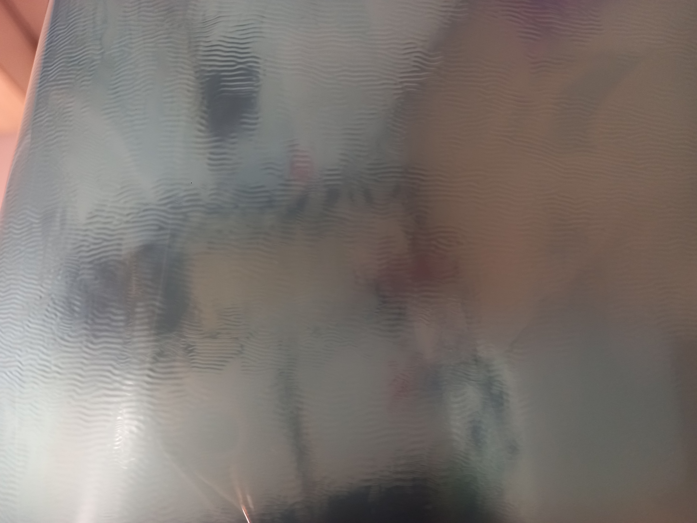  
Вы их можете даже после проявки не увидеть, а вот при травлении они вам все испортят из-за недостаточной адгезии в этих местах.

Перед нанесением фоторезиста очень важно подготовить поверхность. Да, грубые техпроцессы могут и без такового получится, но если дорожка/зазор 0.1-0.15 мм - это обязательно.
Для этого нужно (обязетнльно):
1. Обработать наждачкой P600-P800, промыть изопропанолом и протереть безворсовыми салфетками.
2. Микротравление (10-20 секунд в холодном (15C) 20% растворе персульфата аммония), промыть водой.
2. Обработать в 3-5% растворе гидроксида натрия в течение 2-5 минут, промыть водой.
3. Просушить в печи при 80C 5-10 минут до полной сухости. Вы можете за неиспользуемые технологические поля с краев потрогать заготовку - она должна на ощупь "скрипеть", быть такой же как посуда после тщательного мытья.

Итак, выключаем свет. Чтобы что-то видеть нужно использовать красный или желтый осветительной прибор (это должен именно светодиод этих конкретных цветов, монохроматический, одной длины волны, около 600 нм, не RGB [выше 550 нм фоторезист не чувствителен]).
Достаем рулон, отрезаем нужный кусок. Отрезать квадрат на 1 см больше заготовки. Отрезаем 2 штуки (на каждую из сторон). Я использую для этого резак для бумаги, но вы можете и ножницами:
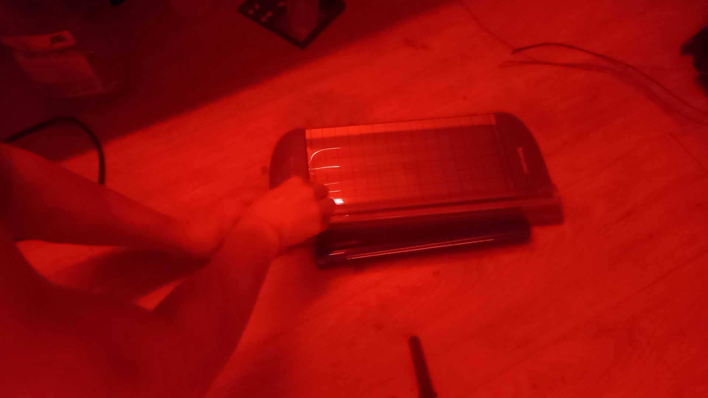

Важно убедиться, что на поверхности фоторезиста нет ряби, в противном случае это брак или у него истек срок годности (бывает, что и такое продают).

Берем лист бумаги A4. Сгибаем пополам, раскрываем, кладем рядом со входом ламинатора, сгибом к нему. С куска фоторезиста снимаем защитную пленку (на более шероховатой стороне), с помощью куска скотча или двух кусков скотча.
Эта пленка должна отдираться плавно (не рывками). Кладем на лист бумаги лист фоторезиста, затем заготовку (остывшую хотя бы до 30C после сушки), затем лист фоторезиста (липкой/шероховатой стороной с которой сняли пленку к заготовке). Посмотрите на мои движения в видео и точно повторяйте их. С другой стороны заготовки тоже самое.
Ну а если не можете лучше возьмите рулонный ламинатор который подороже.
Толкаем все это дело в ламинатор при температуре 140C (потому что в даташите на фоторезист указано 120C но мы компенсируем то что делаем через лист бумаги), сгибом в него. Не ставьте 180C, у вас будут рваться дорожки во время травления, вы даже после проявки можете не заметить что что-то не так. После отделите заготовку от бумаги и убедитесь что нет пузырей, трещин и царапин на пленке фоторезиста, а также нехороших паттернов и неравномерностей вокруг отверстий, все должно быть ровно. Если они есть, пропустите следующий этап засветки, выполните проявку (в результате чего фоторезист смоется весь) и повторите его нанесение.
Далее прогоняем еще от 2 до 7 раз (у меня 5). Вы подберите количество экспериментально. Прогоните слишком мало раз - дорожки могут начать отваливаться при проявке пачками почти сразу после тех мест которые должны отвалиться, либо что хуже пачками отваливаться при травлении. Слишком много - образуются неравномероности, дефекты рисунка, все держится, но в некоторых местах отваливаются (повреждаются) тенты отверстий, при проявке или травлении.

Выглядит процесс так:
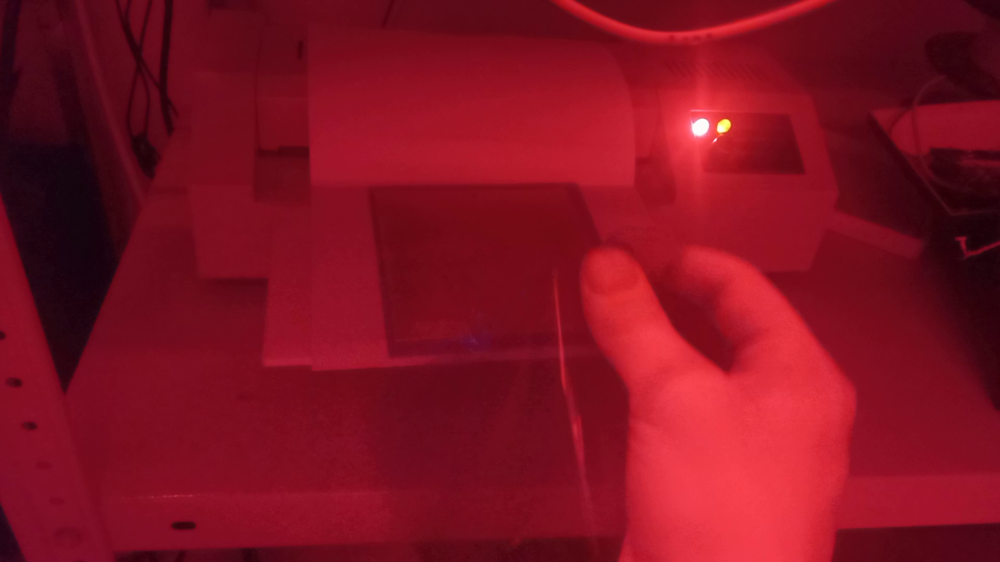

У меня ламинатор Brauberg FGK-230, вы можете использовать другой, но главное чтобы максимальная толщина документа была 2 мм и более.
Важно ламинировать через лист бумаги как я описал, иначе частицы фоторезиста приклеятся к роликам ламинатора и он может выйти из строя с выходом дыма.
Как я говорил лучше использовать рулонный ламинатор.

Не пытайтесь приклеить фоторезист долгим ожиданием, утюгом, под водой, валиком или как-то иначе как советуют многие самоделкины. Только ламинатор даст вам идеальный и повторяемый результат (в противном случае вы будете гадать почему не получается), и прокатите после первичной приклейки N раз. При нарушении данного правила у вас дорожки отвалятся в лучшем случае при проявке, в худшем образуются царапины, пузыри и дефекты.

Да и заметьте на фото моего ламинатора пластиковый выступ, напечатанный на 3D-принтере (файл модели тоже прилагаю). Я собираю бутерброд и сразу толкаю в ламинатор. Собираю на этом выступе, не на столе рядом, чтобы исключить нажатия при перетаскивания, образование складок и пузырей.

Далее у нас идет засветка, как заготовка остынет после ламинации, мы можем к ней приступить. Лазерные установки (HLDI) в домашних условиях крайне трудно собрать, будут постоянные проблемы с фокусировкой лазера и скоростью, можно их конечно решить, но есть более дешевые способы.
DLP-проекторы - рабочее решение, но это дорого и требует модификации оптики и нужные линзы не факт что найдете, да и риск загрязнить матрицу частицей пыли.
LCD-матрица - это то что я выбрал.
Фотошаблон и лампа - тоже допустимый вариант, но только для грубых техпроцессов.

Итак, LCD-матрица должна иметь размер пикселя 25 мкм и менее, быть монохромной и подключенной через HDMI-драйвер, на неё сверху должны смотреть 4 камеры с объективами фокусного расстояния 16 мм и смотреть на реперные знаки и отверстия. Снизу матрицы должен располагаться источник параллельных лучей света (и именно такой) на длину волны 405 нм для засветки, а также красная светодиодная лента по краям, для превью. Минус LCD-матрицы - это контраст, но это не помеха, у моей он 1:300 и этого хватает если нормально подобрать количество ламинирований, время засветки, интенсивность проявки.

Вот так выглядит моя установка:
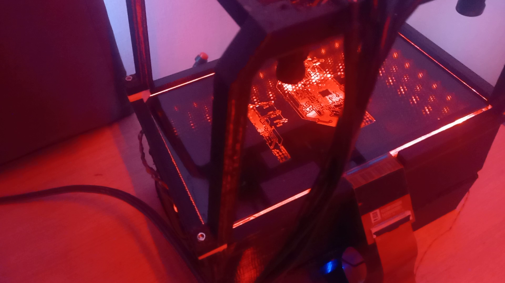

3D модели я предоставляю.

Не пытайтесь выровнять рисунок по реперам путем закручивания в них болтов - точность недостаточна.

С LCD-матрицей все понятно. Подключаем камеры, подключаем HDMI, включаем питание светодиодов, выравниваем по реперам и переключаем цвет с превью на засветку, светим 11 секунд (при мощности светодиодов 200 ватт [да, матрица не очень прозрачна для УФ-волн, всего 5%]), повторяем для второй стороны. В видео показано как в моей программе это делать.

Если фотошаблоны используем, фотошаблон с реперными знаками можно сгенерировать моим ПО которое лежит в этом репозитории и напечатать на струйном принтере на прозрачной пленке от Lomond. У меня принтер Brother DCP-T420W, со встроенным сканером (который можно использовать для контроля качества).
Лазерные принтеры не подойдут - у тонера пористая структура, которая недостаточно черное изображение дает. Да, есть зачернители тонера, но они не работают достаточно хорошо и повторяемо.
Да и среди струйных не все имеют соответствующие настройки для повышенной подачи чернил, чтобы черные участки изображения были максимально черными и максимально блокировали свет.
Лучше брать тот что подороже, с системой непрерывной подачи чернил и с разрешением от 1200 dpi. Дешевые модели (меньше 10 000 руб) дадут очень плохую печать если смотреть под микроскопом.
Совмещать два фотошаблона чтобы усилить контраст - некрасиво, муторно, колхозно и неточно.

В случае с фотошаблоном не используйте лампы, нужен именно светодиод, потому что он как точечный источник света дает жесткие тени с четкими краями, у лампы же тени имеют размытые края. И он должен светить перпендикулярно поверхности фоторезиста, ни в коем случае не под углом (не используйте маникюрные лампы, результат будет плохим).

Вам нужно подобрать время засветки экспериментально: выбрать в меню stouffer.dat (клин Штоуффера). Засветить им несколько заготовок, 10 сек, вторую 20 сек и т.д.
У меня при 6 секундах после проявки смываются все квадраты, при 8 секундах - остается квадрат 1, но он смывается если проявка дольше обычного, при 13 секундах - квадрат 1 остается устойчиво и надежно, и квадрат 2 остается, но смывается при излишней проявке, а вот 11 секунд - идеальное время, квадрат 1 остается и максимально закрепляется, но в то же время квадрат 2 закрепиться не успевает, смывается сразу и мгновенно вместе с последующими.

Далее проявка. Снимаем вторую, жесткую защитную пленку (которая снимается рывками), с помощью куска скотча, ну или царапая края ногтем.
Проявка пленочных фоторезистов осуществляется в 1% водном растворе карбоната натрия или калия (обычно так, для вашего уточните в datasheet вашего фоторезиста). Я использую второе, легче в воде растворяется.
Многие самоделкины погружают заготовку в раствор и потирают её кисточкой, щеткой, или просто помешивают раствор. Для близко расположенных дорожек (0.4 мм и ближе) надежно и повторяемо такое работать не будет.

Нужна установка струйной проявки и травления. 3D модель её прилагаю, схему, проект платы управления и прошивку тоже. Выглядит она так:

Состоит из линейного актуатора с шаговым двигателем сверху который движет заготовку вверх или вниз. 4 насоса через линию форсунок распыляют раствор на поверхность заготовки. Также на дне помимо насосов расположен ТЭН из нержавейки (!) на 1 кВт и терморезистор залитая в эпоксидку для химорезистентности (термопары и биметаллические пластины не использовать), а также вставки вытесняющие воду и уменьшающие требуемый объем раствора чтобы достичь уровня впускного отверстия насосов.
Напечатаны все детали из PETG, так как в ней будут не очень агрессивные химикаты и температуры.
Но периодически (раз в 10 циклов производства) её желательно промывать 5% раствором гидроксида натрия при температуре 30C в течение 10 минут, это должно вымывать застрявшие в форсунках частицы фоторезиста (фиолетовые, засвеченные, отвалившиеся с краев заготовок).

Наливаем 1.5 литра раствора в установку, двигаем заготовку снизу вверх с начальной скоростью 0.4 мм в секунду и конечной 6 мм в секунду при температуре раствора 27C, распыляя раствор при давлении струй в 90%, после вытаскиваем и промываем водой. Все, заготовка проявлена. Не 20C, а 27-30 (как указано в даташите), и давление полива - эти два фактора очень важны чтобы выбить весь фоторезист из узких (0.15 мм) зазоров между дорожками.
У вас скорость движения может отличаться, подберите её. Слишком медленно и отслояться дорожки. Слишком быстро и проявка пройдет не полностью, фоторезист останется между близко расположенными дорожками. Разница между слишком медленно и слишком быстро должна составлять не менее 30-50%, в противном случае это означает что количество ламинирования недостаточно.
С давлением струй тоже самое. Слишком много - выбьет тенты поверх отверстий. Слишком мало - не смоет фоторезист из узких зазоров.

И причем фоторезист оставшийся между близко расположенными дорожками может быть слегка синим и заметен, а может и остаться его там совсем немного, что он будет прозрачным. Единственный способ проверки есть ли он там - это после проявки промыть водой и погрузить в 20% раствор персульфата аммония при температуре 40C и подождать 5 минут. Если есть непроявленные места - они сохранят блеск или царапины от наждачки (текстуру), остальная медь, не покрытая фоторезистом изменит цвет.

Если отвалились в процессе проявки фиолетовые, засвеченные дорожки (в виде твердых кусков) - значит на этапе нанесения было недостаточное количество ламинирования или плохая подготовка поверхности, либо избыточная интенсивность и время проявки. Если они отвалились почти сразу после растворения тех мест которые свободны от дорожек - значит первое.
Если отвалились засвеченные участки, т.е. дорожки (в смысле растворились, перешли из заготовки в раствор, не твердыми кусками, а жидкими разводами, и они не фиолетовые, а голубые) - то время засветки недостаточно, ориентируйтесь на энергию экспонирования указанную в datasheet вашего фоторезиста.

После проявки фоторезиста и промывки водой его адгезию нужно усилить, прогрев заготовку до 70-90C Цельсия в течение 10-20 минут в конвекционной печи до полной сухости (пойдет кулинарная, но не микроволновая, а та что духовка с ТЭНами). Рисунок должен изменить цвет на более темный.

Неплохо бы после такой сушки проявки проверить под микроскопом что над всеми отверстиями образовались тенты (крышки) из пленки фоторезиста. Если тентов почти нет, значит слишком высокое давление струй их уничтожило, удалите фоторезист в ацетоне или гидроксиде натрия (смотрите соответствующий раздел) и делайте заново нанесение, засветку, проявку (уже на меньшем давлении). Либо слишком много ламинирований было, либо слишком высокая температура ламинирования. Вот таких вот дефектов быть не должно (слишком высокая температура ламинирования как правило):
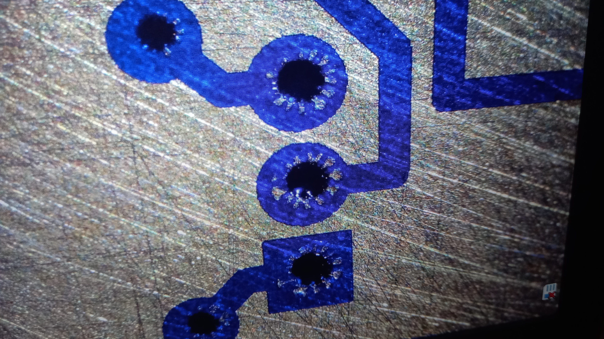

После такой сушки ставим заготовку на подставку и тут она до суток может ожидать следующего этапа.

Имеется миф от самоделкиных, что если передержать заготовку в растворе проявки, то отслоятся дорожки. Чтобы при качественном фоторезисте и нормальной адгезии (после подготовки поверхности и пятикратной прокатки через ламинатор) они отслоились, нужно передержать или переборщить с параметрами струй на 30-50% минимум, либо недостаточное время засветки (это можно определить по клину Штоуффера).

Каждый раз используем свежеприготовленный раствор, отработавший повторно не используем, это может привести к неполной проявке или даже засорению форсунок.

От нанесения до засветки, после засветки и до проявки, а также после проявки и до усиления адгезии в печи должно проходить не более 10 минут. Да, в datasheet пишут что днями фоторезист может выдерживать подобное состояние, но я бы его на это не испытывал.

В папке Etcher данного репозитория 3D модель проявочной установки, схема и проект платы управления и её прошивка. Насосы у меня 12 вольт, 19 ватт, 800 литров в час.
В папке PhotoresistExposure 3D модель установок засветки.
На данном этапе основная сложность в подборе правильного количество ламинирования, времени засветки и интенсивности проявки. Но после того как все подобрано - все работает с очень высокой повторяемостью.
Вот алгоритм который упростит этот процесс.
1. Убедитесь в качестве фоторезиста (отсутствии ряби на нем). Возьмите небольшой кусок стеклотекстолита с медной фольгой. Обработайте наждачкой P800, протрите безворсовыми салфетками смоченными в изопропаноле, выполните микротравление (20% персульфат аммония, 40C, 1 минута), промойте водой и после подержите минуту в 5% растворе гидроксида натрия, затем в воде и высушите в печи при 70-80C. Начните по 1 ламинации. Засветите клином Штоуффера. Выполните ручную проявку в емкости кисточкой.
2. Подберите время засветки: максимальное время при котором при проявке первый квадрат остается, а остальные одновременно смываются. При каждой попытке берите новый кусок, не надо смывать фоторезист и наносить заново на тот же.
3. Зафиксируйте это время. Затем наращивайте количество ламинаций и/или их температуру (но не выше 140C), наблюдая за процессом проявки. Можете делать его в стакане при одинаковой температуре, просто держать заготовку в нем перемешивая проявочный раствор на магнитной мешалке. Засекайте сколько времени проходит с момента полной проявки и до того как начнут отваливаться полезные дорожки. После того как это время перестает расти - нет смысла ламинировать больше раз.
4. Пробуйте теперь вместо клина Штоуффера проводящий рисунок с близко расположенными и тонкими дорожками. Если после проявки вы видите царапины, обрывы, дефекты, нарушенные тенты отверстий - уменьшайте количество ламинирований пока дефекты не исчезнут.
5. Так, количество ламинирований и время засветки подобрано.
Теперь берите полноразмерную заготовку без металлизации с той же подготовкой поверхности (обработка наждачкой + микротравление + гидроксид натрия). При каждой попытке берите новую панель которую вырезал ЧПУ станок - не смывайте фоторезист с предыдущей чтобы нанести его заново, ведь частицы старого могли остаться в отверстиях или испортить качество поверхности.
Подключайте струйную установку. Убедитесь что она соответствует моей 3D модели, у насосов подъем воды не менее 6 м и скорость не менее 800 л/ч у каждого из четырех. Пробуйте проявить на ней на максимальном давлении. Подберите скорость движения заготовки. Если вы наблюдаете нарушение тентов отверстий на широком диапазоне скоростей (границы которого отличаются на треть и более), уменьшите давление струй.
6. Пробуйте после проявки еще и протравить.
Если после проявки появились царапины, обрывы, порезы, дефекты, нарушенные тенты отверстий - уменьшайте количество ламинирований.
Если же это случилось во время травления - проявка была избыточной.
Если во время травления между близко расположенными дорожками остается медь, которая никак не хочет вытравливаться - значит поверх неё остался фоторезист, нужно увеличить интенсивность проявки (скорость движения заготовки уменьшить, а если не помогло - давление струй увеличить), а если не помогло чуть-чуть уменьшить время засветки.
Если форма дорожек после травления исказилась, как будто дорожки из фоторезиста отваливаются - проявка была избыточной.
Важно делать проявку при температуре 27C (чаще всего в datasheet на фоторезист указана именно такая).
6. После того как все три параметра подобраны, попробуйте все тоже самое, но с металлизацией. Если хуже - значит характеристики электролита гальванического осаждения хромают, перейдите на проприетарный электролит, очистите аноды от шлама, отфильтруйте или приготовьте заново раствор.

Время этапа: 15 минут.
Стоимость оборудования: $500 (LCD-матрица, источник параллельного света, ламинатор и т.д., струйная установка).
Стоимость одного цикла: $0.1 (фоторезист + раствор для его проявки).

## Травление проводящего рисунка
Многие самоделкины используют либо хлорное железо либо персульфат аммония.
Первое - чистое, прозрачное, но большое боковое подтравливание, да и работает только при нагреве от 30-40C.
Второе - грязное, раствор все пачкает, но куда более равномерное, работает при комнатной температуре и боковые подтравы (etch undercut) маленькие.

Квадратная емкость, подогрев раствора (вручную вначале), раствор 20-30% (не больше), погружение заготовки в него и периодическое её переворачивание работает лучше всего. Без перемешиваний, ротоспреев и струйных установок тут.

Я рекомендую выбрасывать раствор после использования, так как свежеприготовленный раствор, не наевшийся меди будет работать быстро.

После травления нужно проверить под микроскопом все ли вытравилось, и только потом идти далее. А перед следующим этапом мы промываем заготовку водой и ставим на подставку, там она может ждать следующего этапа до суток.

Время этапа: 30 минут.
Стоимость оборудования: $1 (квадратная емкость).
Стоимость одного цикла: $1 (раствор-травитель).

## Удаление фоторезиста
Его можно проводить в любом пищевом контейнере в который помещается заготовка.

Готовим 5% раствор гидроксида натрия и греем до 30C. Погружаем заготовку и ждем пару минут пока весь фоторезист не отвалится.

Ацетон меньше подходит, потому что хуже снимает фоторезист и образует с ним липкие комплексные соединения.

После этого этапа заготовка на подставке может дожидаться следующего до суток.

Время этапа: 1 минута.
Стоимость оборудования: $1.
Стоимость одного цикла: $0.05.

## Нанесение паяльной маски, засветка, проявка, дубление
Тут два способа:
1) Пленочная маска Dynamask 5000.
Dynamask 5000 наносится вакуумным ламинированием, но обычное ламинирование работает не сильно хуже, да бывает что пузыриться и образуются дефекты, но для меня это некритично. Но в будущем я придумаю как делать вакуумное ламинирование.
Тут я делаю чуть меньше проходов через ламинатор, не больше, а все остальное в нанесении и проявке этой маски аналогично нанесению и проявке пленочного фоторезиста, но время засветки в 1.5 раза больше, но количество ламинирований тоже и с тем отличием, что без микротравления для подготовки поверхности (только гидроксид натрия) и тем что углы желательно вырезать ножницами, чтобы реперные отверстия были видны лучше при засветке (см. видео).

После проявки необходимо посушить несколько минут при 50-60C, дозасветить каждую сторону (я делаю по 15 минут на сторону 50-ваттным светодиодом), одновременно две стороны. Затем держу 1.5 часа при 140C в конвекционной печи для окончательного дубления. Да, воняет, но таков производственный процесс.

По прошествии времени вынимаем заготовку из печи после того как она остынет. Видим что на контактных площадках образовались окислы. Снимаем их в горячем (80C) растворе лимонной кислоты 10-20%, процесс занимает пару минут.

2) Жидкие маски типа RS-2000 или Sun Chemical ImageCure.
Это дешевле, они двухкомпонентные, в них резист и отвердитель. Да, они красят, они разливаются и пачкают все домашние вещи, так как наносятся методом сеткографической (трафаретной) печати, но этот недостаток минует вас если работать осторожно и потом очищать следы ацетоном.
Выключаем свет, оставляем красный. Берем сетку для трафаретной печати, отрезаем кусок, зажимаем в специальной установке и натягиваем, 3D модели прилагаю.
Размешиваем два компонента, ложим на сетку, проводим ракелем. Поднимаем сетку, подсушиваем 10 минут при 50-60C (не больше!). Затем повторяем для другой стороны и тоже так подсушиваем.

Затем аналогично фоторезисту, засветка и проявка. Светим те участки которые должны быть закрыты маской, контактные площадки должны быть черными, без засветки. Интенсивность проявки и время засветки точно также подбираем, хоть и маска не так требовательна к точности их подбора, но у меня время засветки вышло 16 секунд.

Если некоторые контактные площадки остались в маски - увеличиваем интенсивность проявки, если смылось лишнее - уменьшаем. Давление используйте строго такое же как в фоторезисте.
Если окна вскрытия маски шире чем должны быть - то засветки мало, если наоборот уже - то слишком много.

После проявки убираем на место маску и закрывваем все банки, включаем свет, вытираем плату безворсовой салфеткой и если все нормально - выполняем окончательную сушку (1.5 часа при 150C).

По прошествии времени вынимаем заготовку из печи после того как она остынет. Видим что на контактных площадках образовались окислы. Снимаем их в горячем (80C) растворе лимонной кислоты 10-20%, процесс занимает пару минут.

Используем новую сетку при каждом производственном цикле. Используйте всегда сетку одной и той же фирмы с одинаковыми характеристиками чтобы наносить одинаковой толщины слой.

Не надо использовать однокомпонентную маску в шприцах, у неё есть только УФ-отверждение, нет этапа проявки и дубления и она для ремонта плат, не для производства.

Время этапа: 20 минут.
Стоимость оборудования: $50 (установка сеткографической печати).
Стоимость одного цикла: $2 (в случае с Dynamask 5000), $0.5 (в случае с жидкими масками).

## Депанелизация
Возвращаемся к ЧПУ станку. Ставим фрезу. Крепим заготовку через специальное приспособление (3D модель в папке CNC). Перемещаемся на Z отступающим на 2 мм от заготовки. Переходим на вкладку "Депанелизация" в моей программе. Перемещаясь по XY отмечаем где у нас находится панель. Запускаем процесс, предварительно проверив что заготовка стороной Top лежит кверху и правильно повернута, используя превью.

Вот и все, плата у нас готово, осталось только припаять компоненты.

3D модели крепления в папке CNC.

Время этапа: 20 минут.
Стоимость оборудования: $2 (крепление).
Стоимость одного цикла: $0.02 (фреза).

## Печать паяльной пасты, Pick & Place компонентов, пайка в инфракрасной печи
Во-первых любая паяльная паста не подойдет. Она должна быть типа 4 или лучше 5, она должна быть с маркировкой "для трафаретной печати", она должна быть свежекупленной и с правильным сроком годности (да, дорого, не для прототипирования, но никуда не денешься). 
Во-вторых нужно изготовить трафарет. Есть два способа: травление и лазерная резка. Предпочтительнее второй, он куда быстрее, но лазерные маркеры по металлу с пятном 0.01 мм куда лучше справляются, но стоят от $3000.
Поэтому делаем первый, берем лист меди 0.05 мм, отрезаем нужный кусок (на 2 см шире по одной оси чем заготовка), обрабатываем минуту в персульфате аммония, промываем водой, обрабатываем гидроксидом натрия пару минут, наносим фоторезист, светим, проявляем, вытравливаем, снимаем фоторезист. Все аналогично самой плате, концентрации растворов те же
Зажимаем и натягиваем трафарет в той же установке что и при нанесении жидкой маски, выравниваем его:
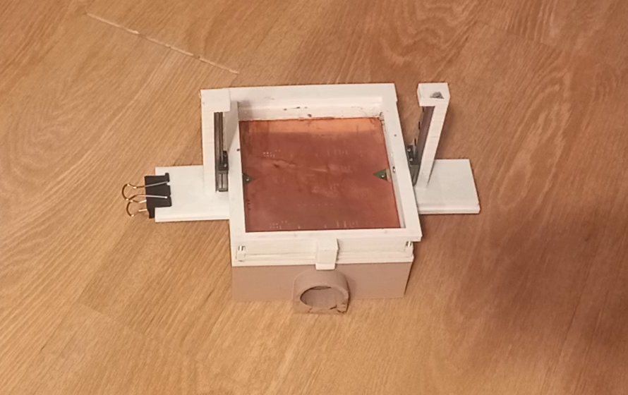

Включаем вакуум, накладываем паяльную пасту, проводим резиновым шпателем, выключаем вакуум, поднимаем трафарет.

Проверяем под микроскопом:
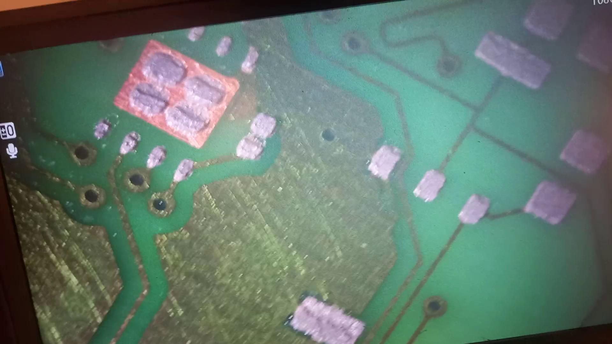

Если что-то слиплось - значит либо трафарет неровный, либо плохие реологические свойства пасты, купите новую и свежую. Но это обычно не сильно страшно.
Если все нормально, можно переходить к Pick&Place станку, расставлять компоненты и оплавлять пасту, и на это у вас есть пара часов после нанесения пасты (ну в её характеристиках может быть указано точное время жизни). Это CNC 3018 MAX, но модифицированный, 3D модели модификаций прилагаю, также прилагаю проект платы управления.
Краткая суть модификаций - вместо шпинделя сопло, с двумя боковыми камерами, рядом на каретке еще одна камера направленная вниз, сзади вакуумный насос и помимо стандартной платы Grbl имеется кастомная плата управления и стол с креплением для платы и компонентов, ну и еще боковая коробка для наконечников сопла:
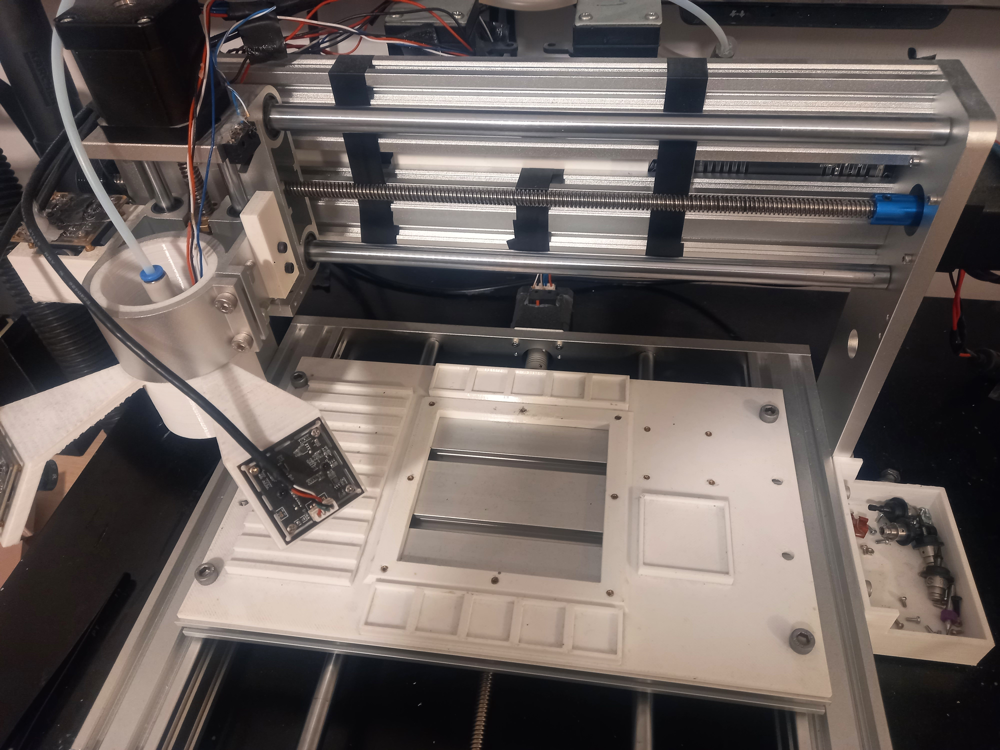
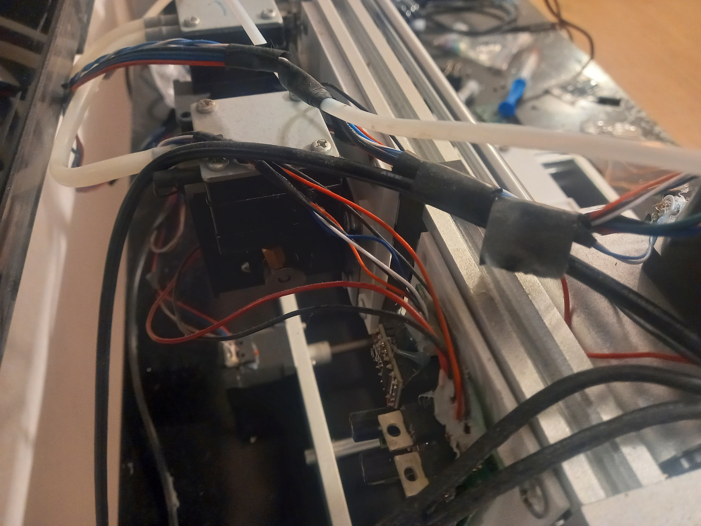
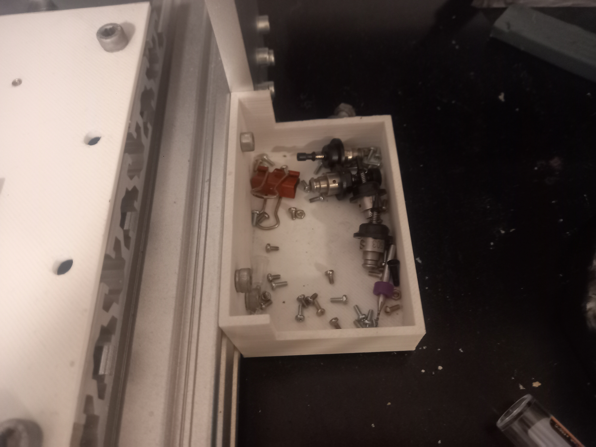

Его нужно тоже откалибровать и вычислить смещение от сопла до камеры.

Затем выбираем местоположение панели. Затем кладем на рабочее поле компонент или ленту из компонентов, перемещаемся так чтобы центр камеры встал в центр компонента, определяем и вводим угол под которым он лежит. Нажимаем "взять и переместить". Затем опускаем, сдвигаем, по двум боковым камерам контролируя позицию. После того как все верно, нажимаем "поставить":

Повторяем для каждого компонента, после оплавляем пасту феном. Инфракрасная печь - плохая идея, её сложно контролировать, неравномерная она. Повторяем для второй стороны, желательна паяльная паста с меньшей температурой плавления чем на первой стороне. Хотя у меня при толщине текстолита 1.5 мм 183C на обоих сторонах работала идеально, но на всякий случай я клеил каптоновый скотч на противоположную сторону чтобы компоненты на ней не отвалились, но при более тонком текстолите такое скорее всего не прокатит. Самую низкую температуру (138C) лучше не использовать, там состав такой, что паяное соединение непрочное в долгосрочной перспективе.

Да, у меня все вручную, но зато быстрая первичная калибровка и заточенность под много разных плат в единичном экземпляре. А вот например OpenPNP больше под массовое производство заточен.

После оплавления могут быть дефекты. Исправить их можно паяльником. Но нужно использовать исправный паяльник (который держит выставленную температуру), свежее жало "топорик" или "игла" с антиоксидным покрытием, ну и температура паяльника минимальная (которая способна плавить) и осторожность максимальная. Флюс для этого процесса я использую ЛТИ-120, но может подойти и другой. Чем качественнее трафарет - тем меньше дефектов.

Но паять с нуля феном и паяльником без паяльной пасты, трафарета, станка и оплавления - плохая идея. Риск отслоить дорожки в десятки раз возрастает, да и трудоемко.

3D модели лежат в папке PNP.

Время этапа: 1-2 часа.
Стоимость оборудования: $500 (CNC 3018 MAX + модификации).
Стоимость одного цикла: $5 (свежая паяльная паста).

## Что дальше?
Изготовление многослойных плат